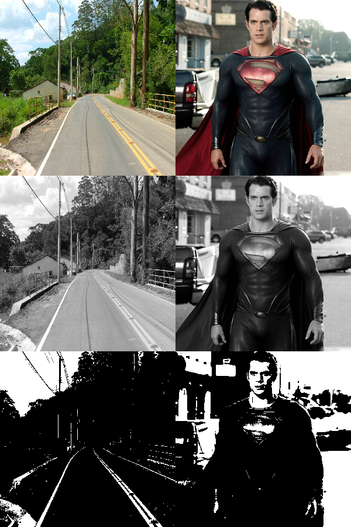

# Processamento de Imagens com OpenCV 

Um projeto simples para demonstrar técnicas básicas de processamento de imagens usando **OpenCV**, incluindo **redimensionamento**, conversão para tons de cinza e binarização. 


[](https://www.python.org/)
[](https://opencv.org/)


## Visão Geral 

Este projeto implementa técnicas fundamentais de processamento de imagens que são essenciais para aplicações de **visão computacional e inteligência artificial**. O foco está em reduzir a carga computacional mantendo os detalhes críticos para reconhecimento de objetos. 

Projeto proposto pelo Bootcamp bairesdev machine learning training e DIO.

**Pré-requisitos**

Antes de executar o projeto, certifique-se de ter: 

   - Python 3.8 ou superior
   - pip (geralmente vem com o Python)
   - OpenCV e NumPy
     

 
## 1. Como usar e configurar ambiente virtual 

## Criar ambiente virtual

```bash
python3 -m venv venv
```

## Ativar ambiente (Linux/Mac)

```bash
source venv/bin/activate
```

## Ativar ambiente (Windows)

```bash
venv\Scripts\activate
```

## Instalar dependências

```bash
pip install opencv-python numpy
```


## 2. Executar o codigo

```bash
python binar,py
```
 

## Resultados:

O programa exibe uma janela única com 6 imagens organizadas em 2 colunas e 3 linhas: 

   - Coluna 1: Processamento da imagem da estrada
   - Coluna 2: Processamento da imagem do Superman
   - Linhas: Imagem original, em tons de cinza e binarizada


     

   
## Explicação Técnica

**Redimensionamento** 

    Reduz a resolução da imagem para um tamanho padrão (300x300 pixels)
    Usa interpolação INTER_AREA para preservar detalhes importantes
    Reduz significativamente a carga computacional
     

**Conversão para Tons de Cinza** 

    Converte de 3 canais (RGB) para 1 canal
    Reduz os dados em 66% sem perder informações visuais críticas
    Simplifica processos posteriores
     

**Binarização** 

    Aplica limiar para converter em preto e branco
    Mantém contornos essenciais para reconhecimento
    Facilita detecção de objetos e padrões
     

## Aplicações Práticas 

Esta técnica é usada em: 

    Sistemas de visão para veículos autônomos
    Reconhecimento de objetos em tempo real
    Processamento de documentos
    Análise de imagens médicas
     

## Como Contribuir 

Contribuições são bem-vindas! Siga estes passos: 

    Faça um fork do repositório
    Crie uma branch para sua feature (git checkout -b feature/nova-feature)
    Commit suas mudanças (git commit -am 'Adiciona nova feature')
    Faça push para a branch (git push origin feature/nova-feature)
    Abra um Pull Request


## Autor

Nicolas Souza  
[LinkedIn](https://linkedin.com/in/nicolas-y-p-souza) | [GitHub](https://github.com/NicolasYPS)
     